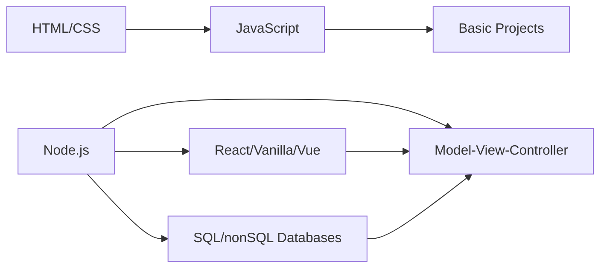

<h1 align="center">⚡ HoneyShot</h1>
<h3 align="center">Electrical Electronics Engineer</h3>

## 🔧 Professional Profile

## 🏭 Professional Experience Highlights

### ⚡ Automation Engineer  
- Developed energy automation/billing systems for commercial facilities  
- Created full-stack applications for smart automation systems  
- Executed installation & configuration of industrial automation systems  

### 🔌 Systems Engineer  
- Managed electrical/low voltage systems for industrial sites  
- Specialized in electronic board maintenance  
- Implemented Layer 1/Layer 2 system installation & maintenance  

### 🏗️ Control Systems Supervisor  
- Oversaw critical infrastructure maintenance systems  

---

## 🧰 Technical Proficiency

| Programming         | FrameWorks           | CAD/Simulation   |
|---------------------|----------------------|------------------|
| Ladder Diagram      | Node.js              | Autodesk AutoCAD |
| JavaScript          | Next.js              | Proteus          |
| C                   | Vite                 | SolidWorks       |
| Python              | DOPSOFT              | Pspice           |
| TypeScript          | TIA PORTAL           |                  |                 

---

## 💻 Programming Skills (Hobby Projects)

  
  
  
  
  

**Web Development Journey:**  

## 🔬 Research Interests
- Industrial IoT and Smart Automation
- Energy Management Systems
- Medical Device Instrumentation
- AGV Navigation Algorithms
- PLC-to-Cloud Integration

## 🔐 Secure Collaboration

  
  

> "Engineering transforms theoretical knowledge into solutions that advance industries and improve lives."
