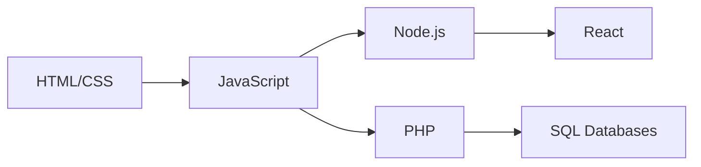

<h1 align="center">⚡ HoneyShot</h1>
<h3 align="center">Electrical Electronics Engineer</h3>

<!--   
   -->

## 🔧 Professional Profile

## 🎚️ Automation Stack Proficiency

| PLC Systems      | HMI Interfaces     | Microcontrollers | CAD/Simulation       |
|------------------|--------------------|------------------|----------------------|
| Delta PLC        | DOPSoft (Delta)    | Arduino          | Autodesk AutoCAD     |
| Siemens S7 1200  | Information Designer| STM32            | Proteus              |
| TIA Portal       | FV-Designer        | FPGA             | Multisim             |
| Ladder Logic     | -----------        | PIC              | EasyEDA              |

---

## 💻 Programming Skills (Hobby Projects)

  
  
  
  
  

**Web Development (Hobby Level):**  

---

## 🔬 Research Interests
- Industrial IoT and Smart Automation
- Energy Management Systems
- Medical Device Instrumentation
- AGV Navigation Algorithms
- PLC-to-Cloud Integration
